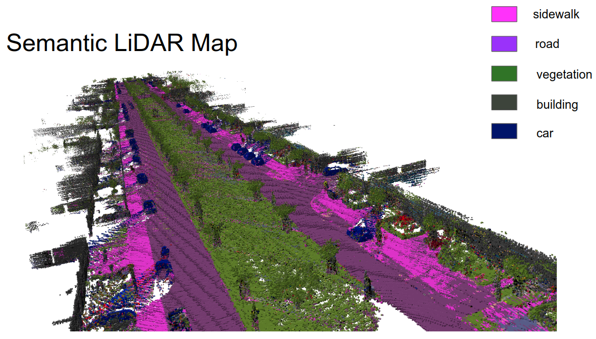
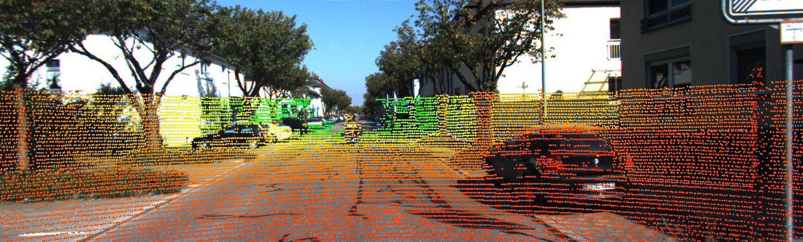
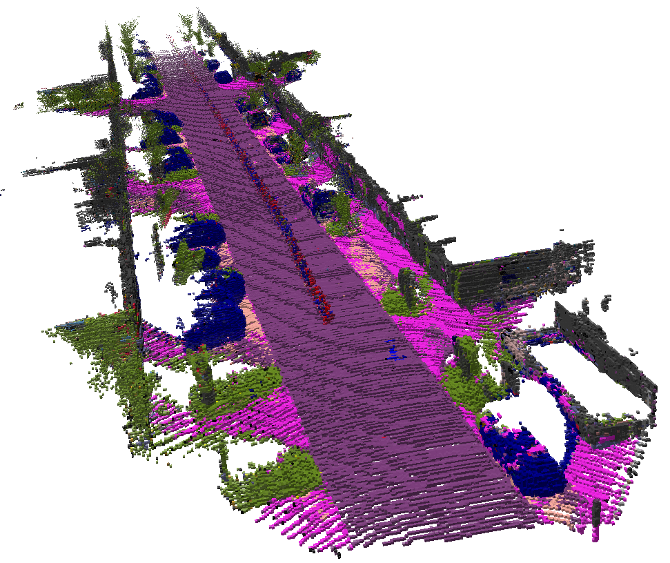

# Semantic Mapping with LiDAR Point Clouds and RGB Images
------------------

The link for temporary datasets is: https://www.cityscapes-dataset.com/downloads/

For test, we are using 'gtFine_trainvaltest.zip (241MB) [md5]' as labels, and using 'leftImg8bit_trainvaltest.zip (11GB) [md5]' as raw input images for training.

When validating our training outcome, we are using the images of 'val' subfolder of the corresponding datasets.

To test our code, we now implement image segmentaion on KITTI datasets.

## LiDAR Mapping

* Take KITTI odometry lidar data and Segmented RGB images as inputs.
* Saving '.ot' file visualized with Octovis.

Following plot is semantic results of KITTI odometry sequence 00.
<p align="center">
  
</p>

### Dependencies

* `OpenCV`
* `Eigen`
* `Octomap`, version 1.9.5, built from https://github.com/OctoMap/octomap devel branch.

### Usage

```
mkdir build
cd build
cmake ..
make
./mapping
```

Before compling codes, choose one of ways for different purposes.

#### 1. Testing
By default, 2 files of lidar data from KITTI odometry sequence 06 are provided, together with calibration file and ground truth pose file. For testing, you can compile codes directly and visualize the data by Octovis.

If you want to check LiDAR-camera projection, please edit line 41 of [code](https://github.com/fangkd8/EECS_504/blob/master/octomap_example/src/buildmap.cpp), set `bool viewProjection = true;`. Projection result is shown in following image.

<p align="center">
  
</p>

Following image is the plot of default data visualization. In the plot, first point cloud is painted as red, second is in blue, merged point cloud is set with ground truth pose.

<p align="center">
  
</p>

#### 2. Full Dataset Mapping
If you want to build full map with whole KITTI dataset sequence, please download KITTI odometry from [webside](http://www.cvlibs.net/datasets/kitti/eval_odometry.php). 

Then edit const bool at line 32,33,36 of [code](https://github.com/fangkd8/EECS_504/blob/master/octomap_example/src/buildmap.cpp) as 
```
const bool fullMap = true;
const int partMap = 100;

// You may want to use provided data.
const bool defaultdata = false;
```
Also at line 30-33 of [code](https://github.com/fangkd8/EECS_504/blob/master/octomap_example/src/buildmap.cpp), edit these to right directory as mentioned in comments.

The following image shows the plot of mapping with semantic label for KITTI sequence 06. 

<p align="center">
  
</p>

#### 3. Part Dataset Mapping
If you had already downloaded KITTI sequence, but lack of computation cost to visualize whole mapping, edit const bool at line 36,37,40 of [code](https://github.com/fangkd8/EECS_504/blob/master/octomap_example/src/buildmap.cpp) as 
```
const bool fullMap = false;
const int partMap = 100;

// You may want to use provided data.
const bool defaultdata = false;
```

The following image shows mapping result containing the first 100 LiDAR point clouds in KITTI sequence 00.

<p align="center">
  
</p>

#### Files in [data](https://github.com/fangkd8/EECS_504/tree/master/octomap_example/data)

* `*.bin`: KITTI LiDAR data.
* `06.txt`: ground truth poses of KITTI odometry sequence 06.
* `mapping.ot`: test LiDAR mapping.
* `mappingFull.ot`: Full raw LiDAR mapping of KITTI odometry sequence 06.
* `mappingPart.ot`: Raw LiDAR mapping of first 100 point clouds in KITTI odometry sequence 06.
* `labeled_pointcloud.ot`: visualization of single labeled point cloud.
* `semantic_mapping_full.ot`: Full semantic LiDAR mapping of KITTI odometry sequence 06.
* `semantic_mapping_part.ot`: Semantic LiDAR mapping of first 100 point clouds in KITTI odometry sequence 00.

`*.ot` files are for visualization with `Octovis`.

Contact
-------

Dianhao Chen  -  chendh@umich.edu

Kaiduo Fang  -  fangkd@umich.edu

Hang Zhang  -  zhhang@umich.edu

Shoutian Wang  -  shoutian@umich.edu
