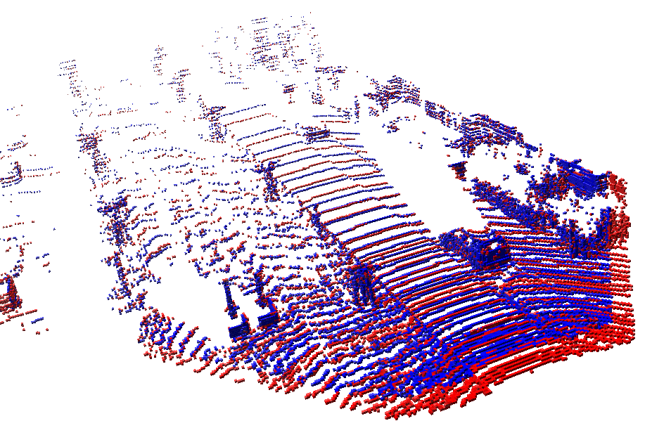

# README and scripts
------------------

The link for temporary datasets is: https://www.cityscapes-dataset.com/downloads/

For test, we are using 'gtFine_trainvaltest.zip (241MB) [md5]' as labels, and using 'leftImg8bit_trainvaltest.zip (11GB) [md5]' as raw input images for training.

When validating our training outcome, we are using the images of 'val' subfolder of the corresponding datasets.

To test our code, we are now using deducted train, label and val sets.

## LiDAR Mapping

* Take KITTI odometry lidar data as inputs.
* Saving '.ot' file visualized with Octovis.

### Dependencies

* `OpenCV`
* `Eigen`
* `Octomap`, version 1.9.5, built from https://github.com/OctoMap/octomap master branch.

### Usage

```
mkdir build
cd build
cmake ..
make
./mapping
```

Before compling codes, choose one of ways for different purposes.

#### 1. Testing
By default, 2 files of lidar data from KITTI odometry sequence 06 are provided, together with calibration file and ground truth pose file. For testing, you can compile codes directly and visualize the data by Octovis.

Following image is the plot of default data visualization. In the plot, first point cloud is painted as red, second is in blue, merged point cloud is set with ground truth pose.

<p align="center">
  
</p>

Contact
-------

Dianhao Chen - dianhao.chen1997@gmail.com


